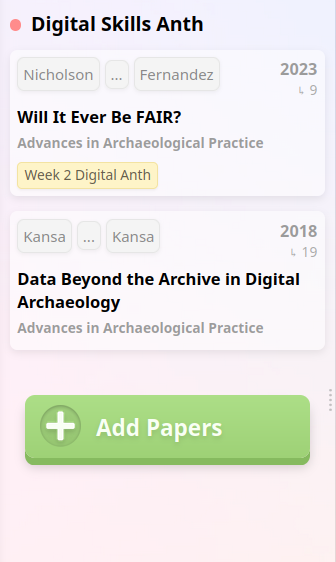

# Week 2 Fail Log - Library Research and Literature Review
---
As of writing, this week is starting out well! Though I haven't finished the week's work just yet, I think I'm starting off strong! Research is one of my favorite parts of academics, but it can be time consuming and tedious at times. So any kind of help I can get I will gladly take.

## First Annotation
My [first annotation](https://app.perusall.com/courses/fall-2025-anthropology-of-science-and-technology-anth-410r-950/will-it-ever-be-fair-week-2?annotationId=qkeHDfN45yfSD9t6P) was my longest and was to make a connection between the worry of an archeology "Digital Dark Age" and similar worries I've seen in online social spaces. I like to talk a lot with friends and colleages about accessibity and open-source projects, so it was neat to be able to make a connection to something I know with something I was learning about.

## Second Annotation
My [second annotation](https://app.perusall.com/courses/fall-2025-anthropology-of-science-and-technology-anth-410r-950/will-it-ever-be-fair-week-2?annotationId=BjBSs8QPiLDqjKao2) was a form of me wondering-out-loud about the interoperability of something like ArcGIS and GIS data. I'm a Geography student, so it's something I'm curious about. After all, even if ArcGIS doesn't go defunct, it has been through many updates and even a particularly large update might make older projects corrupted if the programmers aren't careful.

## Third Annotation
My [third annotation](https://app.perusall.com/courses/fall-2025-anthropology-of-science-and-technology-anth-410r-950/will-it-ever-be-fair-week-2?annotationId=4yYu2ZkMxjPz9EeDY) was a question on how one would go about creating a data management plan (DMP). I'm particularly interested in this as someone who believes in open-source and accessible science but *also* someone who would like to have their research and data more organized than it is, since I can get rather messy in my frenzied work.

---
## Research Tools
### ResearchRabbit
I added the paper ["The FAIR Guiding Principles for scientific data management and stewardship"](https://www.nature.com/articles/sdata201618) by Wilkinson (2016).

| BEFORE | AFTER |
| ----------- | ----------- |
|  |  |

I did this because I felt having the paper that outlines what the FAIR Guiding Principles are would be a good addition to the Nicholson paper, as well as the Kansa paper. It also connects further into the web shown from ResearchRabbit:

### Regular Search Engine (Startpage)
I use [Startpage](https://www.startpage.com/en/about-us) as my search engine of choice due to focus on privacy and a lack of advertisments. When using it to search up "Open Data Archaeology" I was presented mostly with Journals, Records, and Organizations that focus on open data in archaeology.

### Google Scholar
I searched the same "Open Data Archaeology" in Google Scholar and recieved mostly papers on the topics of open data in archaeology.

### Morris Library Resources
I detailed most of my thoughts on the prior two search engines and the Morris Library resources in my post on the discussion board for our class. However, I have screenshotted it to put it here as well:
![A screenshot of a bulleted list of thoughts. The header bullet is bolded and reads "Comparing ResearchRabbit and Google Scholar to the Morris Library Resources". There are six points below it. The first one reads "All three of these are great resources for locating research or data on topics of interest!" The second one reads "That said, I think ResearchRabbit and the Morris Library Resources are more useful overall than Google Scholar, notably because they have built in methods to contain and organize papers or articles you may need later." The third one reads "However, I think ResearchRabbit is not the most perfect to start wtih. Instead, ResearchRabbit strikes me as the type of place you keep track of the papers you need on and use its ability to find similar papers to further your research." The fourth one reads "Google Scholar and Morris Library are also more useful if you need to find something like a textbook, as it seems that ResearchRabbit does not contain books from what I've messed around with." The fifth one reads "Overall, I think Morris Library is a really good place to start research, especially if your topic is local or common enough to be contained in the library's interlibrary loan system." The sixth and last one reads "Google Scholar may prove more useful if you're working outside your local area. Say, needing to find research or data from a country outside of the U.S."](6.png)

---

## Comments/Concerns
I feel like, overall, I'm getting the hang of Github and ResearchRabbit fairly well. I'm still having a lot of trouble with my blog (notably, getting my posts to show, so with that in mind here is a link to my [Week Two Post](https://a-lost-scholar.neocities.org/posts/2025-09-01-Week-2)), but I have some ideas to hopefully fix that. I also had some issues with time management this week, but I think I've gotten a hang on how to handle my classes so failing to turn things in on time doesn't happen again. This felt like a week of learning what some of my limits and my problems are, but I'm glad to take those and work with them going forward.

This week, my main task list is as follows:
- [ ] Switch Neocities blog (Zonelets) to Hashbloge.
- [ ] Plan my work schedule ahead of time so I don't have more/as many time management issues.
